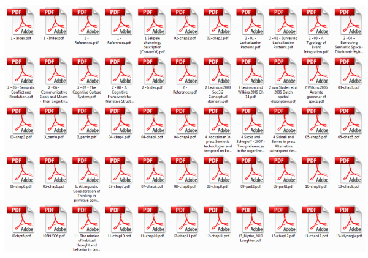
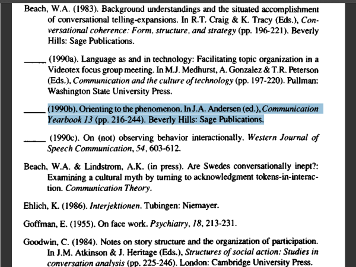
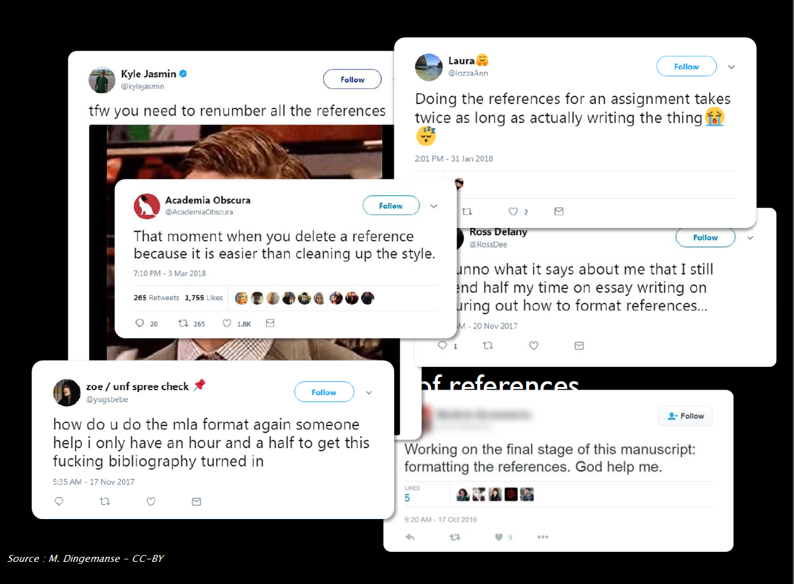
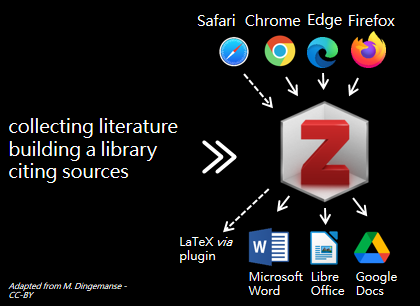
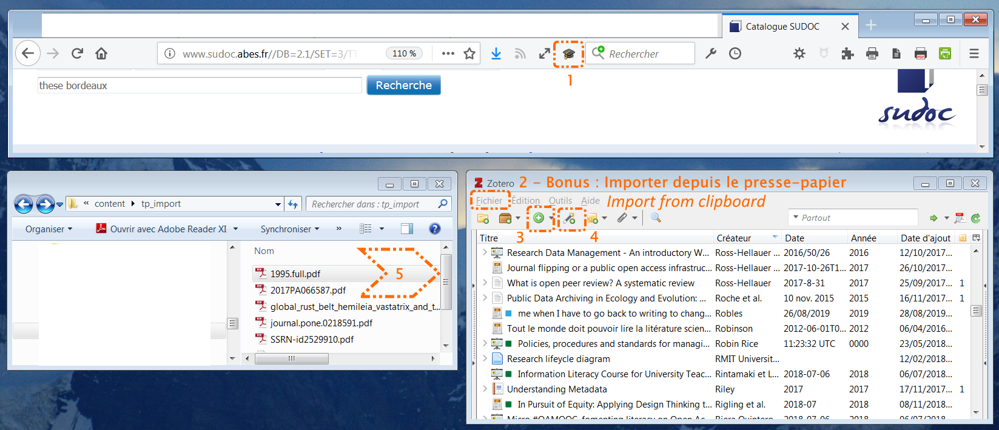
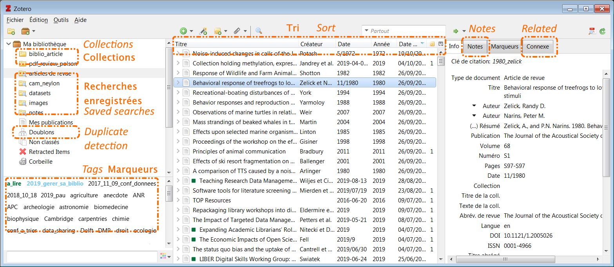
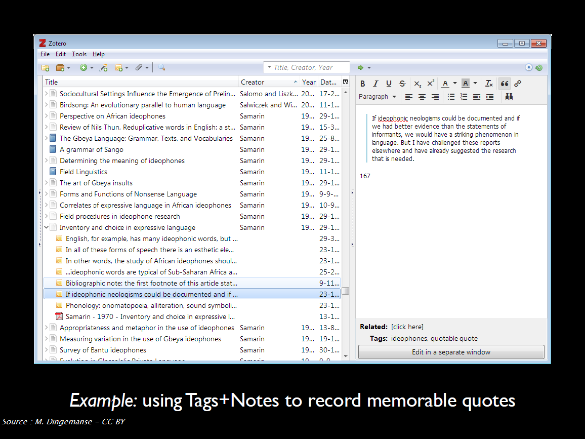

# Introduction to Zotero, soon your personal research assistant

_This handout is mainly a remix and an adaptation of the two following great resources, available under a CC-BY licence._

Dingemanse, M. (2018, March). _Collecting, organizing and citing scientific literature: An intro to Zotero_. https://speakerdeck.com/markding/collecting-organizing-and-citing-scientific-literature-an-intro-to-zotero

EPFL Library Teaching Team. (2020). _Up to speed with Zotero [course notes]_. https://fbib.gitbooks.io/up-to-speed-with-zotero/content/

The following icon ![zotero][zotero] points to the official Zotero documentation, including Zotero forums : it is the best source of help and information !

## Learning objectives
* Building and organizing a library for your bibliographic references and your files
* Citing from your library and creating multiple types of bibliographic outputs
* Getting started with Zotero and knowing how to continue on your own

## Agenda

<!-- MDTOC maxdepth:3 firsth1:0 numbering:0 flatten:0 bullets:1 updateOnSave:1 -->

- [Learning objectives](#learning-objectives)   
- [Agenda](#agenda)   
- [1. Introduction](#1-introduction)   
   - [A common pre-Zotero workflow](#a-common-pre-zotero-workflow)   
      - [Step 1, collecting](#step-1-collecting)   
      - [Step 2, organizing](#step-2-organizing)   
      - [Step 3, citing](#step-3-citing)   
      - [Typical problems](#typical-problems)   
   - [Why Zotero?](#why-zotero)   
      - [Overview](#overview)   
      - [Comparing Zotero and other reference management softwares](#comparing-zotero-and-other-reference-management-softwares)   
      - [More about Zotero](#more-about-zotero)   
- [2. Installing and setting up Zotero](#2-installing-and-setting-up-zotero)   
   - [How to check if the installation worked?](#how-to-check-if-the-installation-worked)   
   - [Tips for setting up Zotero](#tips-for-setting-up-zotero)   
- [3. Building a Zotero library step 1, adding items and files](#3-building-a-zotero-library-step-1-adding-items-and-files)   
   - [Adding content via your web browser](#adding-content-via-your-web-browser)   
   - [Exercise 3-1, adding content with the Zotero Connector](#exercise-3-1-adding-content-with-the-zotero-connector)   
   - [All methods of adding items to your library](#all-methods-of-adding-items-to-your-library)   
      - [1, the Zotero Connector](#1-the-zotero-connector)   
      - [2, importing file or importing from clipboard](#2-importing-file-or-importing-from-clipboard)   
      - [4, with a unique identifier](#4-with-a-unique-identifier)   
      - [5, from PDFs](#5-from-pdfs)   
      - [3, by hand](#3-by-hand)   
   - [Exercise 3-2, try another method of adding content](#exercise-3-2-try-another-method-of-adding-content)   
   - [Checking and editing items](#checking-and-editing-items)   
- [4. Building a Zotero library step 2, organizing content](#4-building-a-zotero-library-step-2-organizing-content)   
   - [Tools to organize your library](#tools-to-organize-your-library)   
   - [Exercise 4-1, getting started with organization](#exercise-4-1-getting-started-with-organization)   
      - [Tagging](#tagging)   
      - [Searching](#searching)   
      - [Taking notes](#taking-notes)   
   - [Going further](#going-further)   
      - [Getting inspiration from what others do](#getting-inspiration-from-what-others-do)   
      - [Full documentation](#full-documentation)   
- [5. Citing with Zotero](#5-citing-with-zotero)   
   - [Citation styles](#citation-styles)   
      - [Citation styles to use](#citation-styles-to-use)   
   - [Exercice 5-1, citing within a word processor document](#exercice-5-1-citing-within-a-word-processor-document)   
   - [More citing features](#more-citing-features)   
- [6. Questions, next steps and conclusion](#6-questions-next-steps-and-conclusion)   
   - [Next steps](#next-steps)   
      - [Backing up and syncing](#backing-up-and-syncing)   
      - [Collaborating with Zotero groups](#collaborating-with-zotero-groups)   
      - [Plugins](#plugins)   
   - [Support](#support)   

<!-- /MDTOC -->

## 1. Introduction

### A common pre-Zotero workflow

#### Step 1, collecting

****

#### Step 2, organizing

****

#### Step 3, citing

#### Typical problems

* Heaps of PDFs with inscrutable file names
* No links between bibliographic references, files, notes
* When citing, copy+paste best option
* Pointless reformatting of references
* Collaboration difficult to organize

In short :

Animated version :

Robles, J. S. (2019, August 26). Me when I have to go back to writing to change the style &amp; references #AcademicLife https://t.co/tFYWKZAkVa [Twitter]. _@DoctorJRo_. https://twitter.com/DoctorJRo/status/1166056789642625024

### Why Zotero?

#### Overview

Zotero is a **reference manager**. When you use a reference manager, the following tasks are (more or less) a 1-click process:

* add/import bibliographic references,
* create a bibliography,
* cite while you write a paper.

All these technical tasks should be done by the software, but remember that **you are the brain**. This means that you should:

* read the documents ;),
* check if the reference data are correct and complete,
* sort and organize your references,
* select relevant references to cite.

##### Note regarding Safari

Why is Safari crossed out? The Zotero Connector for Safari 13 is still in beta version.

Besides, the existing Zotero Connector for Safari was already much more limited than the one for Firefox or Chrome. For example, it didn't support advanced functionalities such as **automatic proxy detection** and **automatic RIS/BibTeX import**.

![zotero][zotero] [Zotero knowledge base : Zotero Connector and Safari 13 ](https://www.zotero.org/support/kb/safari_compatibility)

#### Comparing Zotero and other reference management softwares

| Software -> Feature |  |  |  |  |  |
| :----: | :----: | :-----: | :------: | :------: | :----: |
| **Name**  | BibTeX | EndNote | Mendeley | Papers/ReadCube | Zotero |
| **License** | free license | owned by Clarivate Analytics | owned by Elsevier | owned by Digital Science & Research Solutions, Inc. | free license |
| **Cost** | free of charge | public price : about €100 including student discount | free of charge | $3/ month including student discount | free of charge |
| **suppported OS** |  |  |  |  |  |
| **Full integration with... for writing** | LaTeX | Word LibreOffice | Word LibreOffice LaTeX # | Word LibreOffice Google Docs | Word LibreOffice LaTeX # Google Docs |
| **Number of built-in citation styles** | undefined - Tex distribution dependant | 7,000+   from [EndNote repository](https://endnote.com/downloads/styles/)| 9'500+   from [CSL repository](https://citationstyles.org/authors/)| 9'500+  from [CSL repository](https://citationstyles.org/authors/) | 9'500+ from [CSL repository](https://citationstyles.org/authors/)|

# : through export and auto-update of a BibTex file.

#### More about Zotero

Zotero is **user-friendly** and **powerful**.

Zotero is **compatible with a large number of online resources**: as of March 2020, more than 500 resources are fully compatible  (more than any other reference manager).

It's **free**. Not only free of charge, but above all it's a free and open source software (no restriction due to the license agreement). This means that when you will leave university, you will still be able to use it like you did here.

Zotero has also a **large and active community** of users. If you need help, you can quickly get an answer to the issues you face. If you need a feature, its implementation doesn't depend on the developers' willing to do it: you can ask for it (maybe another user already implemented it) or do it by yourself.

Zotero is **modular**: additional features can be added and shared through plugins.

![zotero][zotero] [Zotero support : Plugins](https://www.zotero.org/support/plugins)

Finally, and even if it's not covered in this workshop, it's important to know that Zotero is **made for collaborative work**, more than any other reference manager. This includes unlimited members and unlimited items for an unlimited number of group libraries. There are storage space limitations, though.

All the reasons above explain why we choose to focus on Zotero.

![zotero][zotero] [Zotero website : Why Zotero?](https://www.zotero.org/why)

## 2. Installing and setting up Zotero

![zotero][zotero] [Zotero documentation : Installation](https://www.zotero.org/support/installation)

![zotero][zotero] [Zotero website : Zotero download page](https://www.zotero.org/download/)

### How to check if the installation worked?

To fully enjoy Zotero, the software should be plugged in your browser and your word processor (Microsoft Word, LibreOffice Writer).

1. Check if Zotero is installed by opening the application on your computer.
2. Open your browser and check that Zotero appears on the top bar, next to the search bar.
3. Open your word processor and check if the Zotero plugin is installed. Usually, after installing Zotero, a new tab will appear in your word processor. Depending on your software, Zotero might alternatively be shown with other "complements".

If the installation of the Word Processor did not work, you can reinstall it from Zotero itself.

1. Open Zotero
2. Go to *Edit > Preferences* (or *Zotero > Preferences* on Mac OS)
3. Click on the *Cite* tab
4. Click on the second tab _Word Processor_
5. At this stage, you can choose to install or reinstall one word processor or more, according to the number you have on your computer.

![zotero][zotero] [Zotero documentation : Word Processor Plugins](https://www.zotero.org/support/word_processor_integration)

![zotero][zotero] [Zotero documentation : Preferences](https://www.zotero.org/support/preferences)

### Tips for setting up Zotero

Here are a few recommendations to get started. All settings are accessible from Zotero _Preferences_.

* Tab **_General_**

  * _Automatically take snapshots when creating items from web pages_ : uncheck this box to avoid systematic saving as attachment of the web page you are visiting when you save a bibliographic reference from an online database or website.
  * _Automatically tag items with keywords and subject headings_ : uncheck this box to limit tags to your own personal tags.

* Tab **_Advanced_ > _General_**

In the _OpenURL_ > _Link resolver_ field, copy and paste the following URL :

https://babordplus.hosted.exlibrisgroup.com/primo-explore/openurl?&Force_direct=false&vid=33PUDB_UB_VU1&institution=33PUDB_UB&

We will use this feature later on during the workshop.

![zotero][zotero] [Zotero documentation : Locate Menu > Library Lookup](https://www.zotero.org/support/locate#library_lookup)

## 3. Building a Zotero library step 1, adding items and files

A bibliographic reference, an **item** in your Zotero library, consists of information, **metadata**, describing a document and allowing you to easily find this document later. Zotero structures the metadata you collect about documents. When you cite your documents with Zotero, it will then generate consistent bibliographies. Zotero also allows you to store digital files along with the references, as **attachments**.

### Adding content via your web browser

This is the :

* **easiest**,
* **most reliable**,
* **most recommended**,

method of adding content to your library.

The Zotero Connector is the plugin that you have installed in your browser. This plugin will detect the bibliographic references available on the pages you are visiting.

Open Zotero and click on the "Save to Zotero" button in your browser to save the bibliographic reference as an item in your Zotero library. Zotero will also try to save at the same time the full-text PDF file as an attachment.

Example : [an article from Journal of Wine Research](https://doi.org/10.1080/09571264.2018.1433140)

**|!| Tips : choose the right source of information and do not procrastinate**

The best is to collect bibliographic references **while you are in the process of looking for information**. By that, we mean that you will be more efficient if you directly collect the metadata while you are on the website / database / library catalog where you find your documents. In this way, you won't need to find the reference a second time afterwards.

Prefer **reliable and exhaustive sources of information**, at least when you save information, _i.e._ :
* publisher sites and bibliographic databases for journal articles and book chapters (SpringerLink, Scopus, Cairn, etc. // avoid Google Scholar),
* library catalogs for books (Babord+, WorldCat // avoid amazon).

In other words, you may start your search using Google or Google Scholar, but when it comes to saving information, do not forget to go to the article’s own page or to the creator of the content's website.

### Exercise 3-1, adding content with the Zotero Connector

We will take **10 minutes** for this exercise.

Browsing the websites you usually use for bibliographic searching, save new items in your library.

* Check **full-text** : was the full-text PDF file systematically saved as an attachment? If not, how would you find and add it to the corresponding item in your library?
* Check the **accuracy** of the information : did you collect all relevant information? Do you think you should edit or add information? In which fields?

### All methods of adding items to your library

![zotero][zotero] [Zotero Documentation : Adding items](https://www.zotero.org/support/adding_items_to_zotero)

![zotero][zotero] [Zotero Documentation : Attaching files](https://www.zotero.org/support/attaching_files)

#### 1, the Zotero Connector
This is the method we have just used.

#### 2, importing file or importing from clipboard

Some databases or catalogs can provide you with a downloadable file containing one or more references. The most common formats for these kinds of files are RIS (.ris) or BibTeX (.bib). It is most useful for large scale exports or when moving from another reference manager.

#### 4, with a unique identifier

Documents are often assigned a unique identifier: this might help when you have a copy of this document and you want to add the reference to Zotero.

In Zotero, if you click on the magic wand icon in the top bar, a dialog box appears.
1. Type the identifier of the document.
2. Press enter.
3. A new item is added to your library.

Example : the ISBN of a book  or a report, the DOI of a scientific paper.

#### 5, from PDFs

If you already have stored PDFs on your computer, it might be possible to retrieve metadata from them afterwards.

**/!\\ This is not the recommended default method**.  It is useful for processing a bunch of PDFs you have in stock, but this should not be your usual method of adding content to your Zotero library.

To add the PDF to Zotero, just drag it from a folder and drop it in your library. Zotero automatically searches for metadata and automatically creates an item attached to the PDF file when possible. However, it might be that the PDF you added to your Zotero library is not machine-readable or is not recognized by Zotero. In that case, no metadata will be retrieved. You will have to add metadata using DOI or by hand, using _Create Parent Item_ feature.

You can also retrieve metadata for several PDFs at the same time.

Example : a PDF sent by a colleague

![zotero][zotero] [Zotero Documentation : Retrieve PDF metadata](https://www.zotero.org/support/retrieve_pdf_metadata)

#### 3, by hand

Sometimes, there is no available metadata encoded in the webpage you are visiting or the document you have in your hands is not indexed in a digital catalog. You will need to create or edit the reference yourself.

In Zotero, you can create a new item by clicking on *File > New Item* or on the green circle with a plus. Either way, you will need to choose **the type of document** you want to create an item for (_i. e._ "Book", "Report", etc.). When you select the type of document, a blank item appears. You can then fill the fields according to the document you have in front of you. In all cases, it is best to be exhaustive as possible and to give as much information as possible.

### Exercise 3-2, try another method of adding content

We will take **10 minutes** for this exercise.

Add content using another method than the Zotero Connector.

* **Magic wand** : use this DOI : 10.18111/9789284421442
* **Manual entry** : a poster, a presentation or any other item you would need to cite and you cannot find online
* **From PDF** : use 
* **Importing file** : use 

### Checking and editing items

Do not forget to check and edit the items you save in your library, this is part of adding content!

Zotero provides smart features to make this easier and faster than making every change by hand. For example :
* right-click on the content of a `Creator` field to invert name and last name,
* right-click on the content of a `Title` field to transform the text and convert it from sentence case to title case (and vice-versa),
* etc.

![zotero][zotero] [Zotero Documentation : Adding Items > Editing items](https://www.zotero.org/support/adding_items_to_zotero#editing_items)

![zotero][zotero] [Zotero Documentation : Adding Items > Verify and edit your records](https://www.zotero.org/support/adding_items_to_zotero#https://www.zotero.org/support/adding_items_to_zotero#verify_and_edit_your_records)

![zotero][zotero] [Zotero knowledge base : How do I use rich text formatting, like italics and sub/superscript, in titles?](https://www.zotero.org/support/kb/rich_text_bibliography)

## 4. Building a Zotero library step 2, organizing content

A good library

* offers multiple ways of browsing/searching,
* has complete and definitive metadata,
* makes studying and note-taking easy.

Zotero offers various features and tools to organize your library efficiently.

### Tools to organize your library

We will focus on some most useful features as you are starting your library, that is to say:
* tags,
* searches -> quick vs. advanced, immediate vs. saved with dynamic update,.
* notes.

**/!\\** In Zotero, the icon associated with a **collection** is a folder but collections are more like **music playlists** (think of iTunes, Spotify, etc.) than folders in your computer filesystem.

### Exercise 4-1, getting started with organization

We will take **10 minutes** for this exercise.

#### Tagging

* Create a tag **read**
* Assign it a color
* Add it to all  items in your library : how do you batch do it ? 2 methods are possible
* How many colored tags can you create?

#### Searching

* Quick search : what difference do you make between searching  “All Fields & Tags” and searching “Everything” ?
* Create a saved search to retrieve all the articles tagged as **read** AND saved in your library within the last 7 days.

#### Taking notes

* Can you create different types of notes?
* What would you use notes for?

### Going further

**|!| Tip : let Zotero works for you**

Keep in mind that filing items in collections, adding tags, etc. requires manual input and takes time. **Saved searches** are a great way to save time and efficiency, using automatically the information you have retrieved and added for each item.

#### Getting inspiration from what others do

Another example :

Saunders, T. (2019, February 13). _Guide to Getting the Most out of Zotero_. Tom Saunders. https://tomsaunders.co.nz/zotero-guide/

#### Full documentation

![zotero][zotero] [Zotero Documentation : Collections and Tags](https://www.zotero.org/support/collections_and_tags)

![zotero][zotero] [Zotero Documentation : Searching](https://www.zotero.org/support/searching)

![zotero][zotero] [Zotero Documentation : Sorting](https://www.zotero.org/support/sorting)

![zotero][zotero] [Zotero Documentation : Notes](https://www.zotero.org/support/notes)

![zotero][zotero] [Zotero Documentation : Related Items](https://www.zotero.org/support/related_items)

![zotero][zotero] [Zotero Documentation : Duplicate Detection](https://www.zotero.org/support/duplicate_detection)

## 5. Citing with Zotero

### Citation styles

Citation styles change how citations appear in your texts and the way bibliographic information is displayed when you create a bibliography.

A citation style applies rules about which metadata to display for each document type as well as how to format the in-text citation and the reference in the bibliography. These citation styles can be defined by publishers, scientific societies or individuals, for instance. You could off course apply the citation rules by hand, but Zotero will be faster and more consistent. For example, Zotero will:

* count authors and display _et al._ when needed;
* calculate, generate and update accurate in-text citations, wether numeric or author-date;
* include all the references you have cited in your text in the bibliography;
* sort this bibliography according to the requirements of the citation style;
* handle and fix punctuation, capitalization, indentation;
* _and much more..._

It is possible to modify or create one's own citation style, but we don't cover this topic in this course.

#### Citation styles to use

Two citation styles may be appropriate for your works related to Master Wintour.

* American Psychological Association (APA) 7th edition : [several variations of APA](https://www.zotero.org/styles?q=APA) are available from Zotero style repository.
* Wintour numeric and author-date :custom local styles downloadable from the GitHub repository of this handout, [download Wintour numeric style](https://github.com/fflamerie/zotero_intro_to/blob/master/content/wintour_numeric.csl) - [download Wintour author-date style](https://github.com/fflamerie/zotero_intro_to/blob/master/content/wintour_author_date.csl). Please note these 2 styles  support only **English** and no other languages.

To manage citation styles, go to Zotero _Preferences_ > _Cite_ > _Styles_. Citations styles can be added in 2 different ways.

1. From Zotero style repository -> this is the way you will install APA and other standard styles. In this repository you can search citation styles by title, format and field. For each style, a preview is available.
2. Directly from a .csl file saved on your computer -> this is the way you will install Wintour styles. Click on the **+** sign, just below the preloaded style list Zotero

![zotero][zotero] [Zotero Documentation : Citation styles](https://www.zotero.org/support/styles)

![zotero][zotero] [Zotero Documentation : Preferences > Cite](https://www.zotero.org/support/preferences/cite)

### Exercice 5-1, citing within a word processor document

We will take **20 minutes** for this exercise.

You have been distributed a printed copy of a text including in-text citations and a final bibliography. The citation style is **APA 7th edition**.

Produce a document identical to this text.

* Download [the Word template](https://github.com/fflamerie/zotero_intro_to/blob/master/content/zotero_citing_exercise.docx).
* Retrieve and add to your Zotero library the bibliographic references cited, you should find all of them online.
* Make sure you have installed APA style.

**|!| Tips**

* Do not forget to type the title "Bibliography", as it will not be generated by Zotero.
* Want to know more about citing theses according to APA 7th ? Check this webpage :

Purdue Writing Lab. (n.d.). _APA Formatting And Style Guide (7th Edition): Reference List: Other Print Sources_. Purdue Writing Lab. Retrieved 17 March 2020, from https://owl.purdue.edu/owl/research_and_citation/apa_style/apa_formatting_and_style_guide/reference_list_other_print_sources.html

**Bonus questions**

* Try to get a full-text pdf file for each document : is it possible **using only legal means**?
* What features do you use?

![zotero][zotero] [Zotero Documentation : Word processor integration](https://www.zotero.org/support/word_processor_integration)

### More citing features

Zotero also does the following.
* Create **independent bibliographies** in various formats (.html, .rtf).
* Insert **in any document** (email, .pptx file, etc.) properly formatted bibliographic references by a simple drag and drop with Zotero quick copy.
* Create **dynamic collaborative bibliographies online**, through private or public shared libraries with Zotero groups.

![zotero][zotero] [Zotero Documentation : Creating bibliographies > Right-click to create citation/bibliography](https://www.zotero.org/support/creating_bibliographies#right-click_to_create_citationbibliography)

![zotero][zotero] [Zotero Documentation : Creating bibliographies > Quick copy](https://www.zotero.org/support/creating_bibliographies#quick_copy)

![zotero][zotero] [Zotero Documentation : Groups](https://www.zotero.org/support/groups)

Zotero is also compatible with other writing softwares and services (such as Overleaf or Authorea).

Using LaTex or services relying on a BibTeX file ? Install [Better BibTex (BBT) - plugin](https://retorque.re/zotero-better-bibtex/).

## 6. Questions, next steps and conclusion

This training course was intended to give you the basics to start working with Zotero. Here are some tips to continue on your own and turn Zotero into your personal research assistant.

### Next steps

#### Backing up and syncing

When you install Zotero, a `Zotero` directory is automatically created in your user profile. Zotero stores in this directory all its data and notably :
* your bibliographic references and your notes in a local database,
* your PDF and other attached files in a sub-directory `storage`.

Make sure your Zotero data directory is included in the backups of your computer.

![zotero][zotero] [Zotero Documentation : The Zotero Data Directory](https://www.zotero.org/support/zotero_data)

**/!\\  Syncing is not a recommended strategy for backing up** . Indeed, the Zotero servers only store the most recent version of your library, and it takes just a single (possibly automatic) sync to change the server copy. Syncing is useful to get a copy of your library in multiple devices and to create group libraries, but it is different from backing up.

![zotero][zotero] [Zotero Documentation : Syncing](https://www.zotero.org/support/sync)

#### Collaborating with Zotero groups

Zotero groups allow you to share a Zotero library with other users. You have to enable syncing to use this feature.

Group libraries are separate from your personal "My Library".

![zotero][zotero] [Zotero Documentation : Zotero Groups](https://www.zotero.org/support/groups)

#### Plugins

You may enhance Zotero features and add new ones with plugins.

You will find a complete list of available plugins from Zotero Documentation. Besides [Better BibTex (BBT)](https://retorque.re/zotero-better-bibtex/) if you use LaTeX, the first plugin to install should probably be [ZotFile](http://zotfile.com/). Among other features, ZotFile will :
* automatically rename your PDF and other attached files,
* attach new files to Zotero items from a specified folder,
* sync PDFs from your Zotero library with your mobile PDF reader (iPad, tablet).

![zotero][zotero] [Zotero Documentation : Plugins for Zotero](https://www.zotero.org/support/plugins)

### Support

Your local librarians will help you using Zotero.

However, remember that Zotero is strongly supported by its developers and by its community of users.

You will certainly find answers to your questions and help to solve your problems :
* in [Zotero Documentation](https://www.zotero.org/support), including [Zotero Knowledge Base](https://www.zotero.org/support/kb),
* on [Zotero Forums](https://forums.zotero.org/).

![zotero][zotero] [Zotero Documentation : Getting help](https://www.zotero.org/support/getting_help)

[zotero]: img/icone_zotero.png

# Credits

 This document is shared under  <a rel="license" href="http://creativecommons.org/licenses/by-sa/3.0/fr/"> Creative Commons Attribution -  ShareAlike3.0 France Licence </a>.

**Author**

Frédérique Flamerie

 [orcid.org/0000-0001-6014-0134](https://orcid.org/0000-0001-6014-0134)

**Visual graphics**

[Zotero website](https://www.zotero.org)
