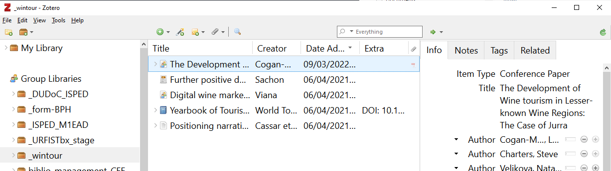

# Introduction to Zotero, soon your personal research assistant

The following icon ![zotero][zotero] points to the official Zotero documentation, including Zotero forums : it is the best source for more information and some help !

## Learning objectives

* Building and organizing a library for your bibliographic references and your files
* Citing from your library and creating multiple types of bibliographic outputs
* Getting started with Zotero and knowing how to continue on your own

## Agenda

<!-- MDTOC maxdepth:1 firsth1:0 numbering:0 flatten:0 bullets:1 updateOnSave:1 -->

- [Learning objectives](#learning-objectives)   
- [Agenda](#agenda)   
- [1. Introduction](#1-introduction)   
- [2. Installing and setting up Zotero](#2-installing-and-setting-up-zotero)   
- [3. Building a Zotero library step 1, adding items and files](#3-building-a-zotero-library-step-1-adding-items-and-files)   
- [4. Building a Zotero library step 2, organizing content](#4-building-a-zotero-library-step-2-organizing-content)   
- [5. Citing with Zotero](#5-citing-with-zotero)   
- [6. Questions, next steps and conclusion](#6-questions-next-steps-and-conclusion)   

<!-- /MDTOC -->

<div style="page-break-after: always;"></div>

## 1. Introduction

### Overview

Zotero is a **reference manager**. When you use a reference manager, the following tasks are (more or less) a 1-click process:

* add/import bibliographic references,
* create a bibliography,
* cite while you write a paper.

All these technical tasks should be done by the software, but remember that **you are the brain**. This means that you should:

* read the documents ;),
* check if the reference data are correct and complete,
* sort and organize your references,
* select relevant references to cite.

Zotero solves the following difficulties that can be encountered when doing bibliography without software (the list is not exhaustive).

* Heaps of PDFs with inscrutable file names
* No links between bibliographic references, files, notes
* When citing, copy+paste best option
* Pointless reformatting of references
* Collaboration difficult to organize


#### Note regarding Safari

Why is Safari crossed out? The compatibility with Safari is unfortunately reduced.

Besides, the existing Zotero Connector for Safari was already much more limited than the one for Firefox or Chrome. For example, it didn't support advanced functionalities such as **automatic proxy detection** and **automatic RIS/BibTeX import**.

![zotero][zotero] [Zotero knowledge base: Zotero Connector and Safari ](https://www.zotero.org/support/kb/safari_compatibility)


### Zotero is an open source software

Why does it matter?

* Users can contribute to the software - see [full list of Zotero add-ons](https://www.zotero.org/support/https://www.zotero.org/support/plugins), and participate in the user community through the [Zotero Forum](https://forums.zotero.org/).
* Development is agile and user-oriented.
* Zotero is developed by a non-profit organization, with no financial interest in your data; you are not required to create an account to use Zotero.

![zotero][zotero] [Zotero website : Why Zotero?](https://www.zotero.org/why)

## 2. Installing and setting up Zotero

In this section, we will briefly see how to install and set up Zotero.

### Installing Zotero

![zotero][zotero] [Zotero website : Zotero download page](https://www.zotero.org/download/)

You need to install both the **Zotero application** AND the **Zotero connector** for your browser (Chrome, Firefox or Edge).


The steps may vary depending on your operating system, you will find detailed instructions in the documentation.

![zotero][zotero] [Zotero Documentation: Installation](https://www.zotero.org/support/installation)


### How to check if the installation worked?

To fully enjoy Zotero, the software should be plugged in your browser and your word processor (Microsoft Word, LibreOffice Writer).

1. Check if Zotero is installed by opening the application on your computer.
2. Open your browser and check that Zotero appears on the top bar, next to the search bar.
3. Open your word processor and check if the Zotero plugin is installed. Usually, after installing Zotero, a new tab will appear in your word processor. Depending on your software, Zotero might alternatively be shown with other "Complements".

If the installation of the Word Processor did not work, you can reinstall it from Zotero itself.

1. Open Zotero
2. Go to *Edit > Preferences* (or *Zotero > Preferences* on Mac OS)
3. Click on the *Cite* tab
4. Click on the second tab _Word Processor_
5. At this stage, you can choose to install or reinstall one word processor or more, according to the number you have on your computer.

![zotero][zotero] [Zotero Documentation: Word Processor Plugins](https://www.zotero.org/support/word_processor_integration)

![zotero][zotero] [Zotero Documentation: Preferences](https://www.zotero.org/support/preferences)

### Minimal setting-up of the preferences

Here are a few recommendations to get started. All settings are accessible from Zotero _Preferences_.

#### Tab "General"

  * _Automatically take snapshots when creating items from web pages_: uncheck this box to avoid systematic saving as attachment of the web page you are visiting when you save a bibliographic reference from an online database or website.
  * _Automatically attach associated PDFs and other files when saving items_: check this box to automatically retrieve PDFs of articles when you are on a publisher's site or any other site where the PDF is present. If you are on PubMed, Scopus or another bibliographic database, you will have to follow the link to the publisher's site to save the bibliographic reference and the PDF of the article at the same time. And of course, if it is a paying resource, your institution must be a subscriber.
  * _Automatically retrieve metadata for PDFs_: check this box.

#### Tab "Advanced-General"

In the _OpenURL_ section, open the drop-down menu and navigate in the geographical list to select "Université de Bordeaux".


This will allow you to generate the Babord+ page of a document from your Zotero library. This Babord+ page displays all access options available from the University of Bordeaux. Using this feature, you will be able to find PDFs that Zotero can not download automatically.

All you have to do is click on _Library Lookup_, accessible from the **Locate** menu, _i.e._ the green arrow at the top of the right pane in your Zotero library.

![zotero][zotero] [Zotero Documentation: Locate Menu > Library Lookup](https://www.zotero.org/support/locate#library_lookup)

#### Tab "Sync"

It is not necessary to create an online account or to enable synchronization to use Zotero. However, it is required for the following two features:

* **syncing** Zotero libraries on multiple devices (e.g. a work computer and a home computer) and on the Zotero online server,
* **groups** to create shared libraries.

To make a group library of which you are a member appear in Zotero, you need to set up Zotero synchronization.

These settings are accessible from _Preferences_ > _Sync_.

To get started, we stick to the following settings after you enter your username and password.

##### Data Syncing

Check _Sync automatically_.

##### File Syncing

* Uncheck _Sync attachment files in My Library using..._, unless you have checked this box yourself and set the service to use for synchronizing your attachments.
* Check _Sync attachment files in group libraries using Zotero storage_.


![zotero][zotero] [Zotero Documentation: Syncing](https://www.zotero.org/support/sync)

Once syncing is enabled, you should see a new "Group Libraries" section in Zotero, below "My Library".

In this section, you should see the group libraries of which you are a member.



## 3. Building a Zotero library step 1, adding items and files


In this section, we will explore how to add content to a Zotero library.

A bibliographic reference, an **item** in your Zotero library, consists of information, **metadata**, describing a document and allowing you to easily find this document later. Zotero structures the metadata you collect about documents. When you cite your documents with Zotero, it will then generate consistent bibliographies. Zotero also allows you to store digital files along with the references, as **attachments**.


### Adding content via your web browser

This is the :

* **easiest**,
* **most reliable**,
* **most recommended**,

method of adding content to your library.

The Zotero Connector is the plugin that you have installed in your browser. This plugin will detect the bibliographic references available on the pages you are visiting.

Open Zotero and click on the "Save to Zotero" button in your browser to save the bibliographic reference as an item in your Zotero library. Zotero will also try to save at the same time the full-text PDF file as an attachment.

Example : [an article from PLOS Computational Biology](https://doi.org/10.1371/journal.pcbi.1008819)

**💡 Tips: choose the right source of information and do not procrastinate**

The best is to collect bibliographic references **while you are in the process of looking for information**. By that, we mean that you will be more efficient if you directly collect the metadata while you are on the website / database / library catalog where you find your documents. In this way, you won't need to find the reference a second time afterwards.

Prefer **reliable and exhaustive sources of information**, at least when you save information, _i.e._ :

* publisher sites and bibliographic databases for journal articles and book chapters (SpringerLink, Scopus, ScienceDirect, etc. // avoid Google Scholar),
* library catalogs for books (Babord+, WorldCat // avoid Amazon).

In other words, you may start your search using Google or Google Scholar, but when it comes to saving information, do not forget to go to the article’s own page or to the creator of the content's website.

### Exercise "Adding content with the Zotero Connector"

We will take **10 minutes** for this exercise.

Browsing the websites you usually use for bibliographic searching, save new items in your library.

* Check **full-text**: was the full-text PDF file systematically saved as an attachment? If not, how would you find and add it to the corresponding item in your library?
* Check the **accuracy** of the information: did you collect all relevant information? Do you think you should edit or add information? In which fields?

### All methods of adding items to your library


![zotero][zotero] [Zotero Documentation: Adding items](https://www.zotero.org/support/adding_items_to_zotero)

![zotero][zotero] [Zotero Documentation: Attaching files](https://www.zotero.org/support/attaching_files)

#### 1, the Zotero Connector
This is the method we have just used.

#### 2, importing file or importing from clipboard

Some databases or catalogs can provide you with a downloadable file containing one or more references. The most common formats for these kinds of files are RIS (.ris) or BibTeX (.bib). It is most useful for large scale exports or when moving from another reference manager.

**💡Tip: on some sites, this export is better configured than saving through the Zotero connector.**

#### 4, with a unique identifier

Documents are often assigned a unique identifier: this might help when you have a copy of this document and you want to add the reference to Zotero.

In Zotero, if you click on the magic wand icon in the top bar, a dialog box appears.

1. Type the identifier of the document.
2. Press enter.
3. A new item is added to your library.

Example : the ISBN of a book  or a report, the DOI or PMID of a scientific paper.

#### 5, from PDFs

If you already have stored PDFs on your computer, it might be possible to retrieve metadata from them afterwards.

**⚠️ This is not the recommended default method**.  It is useful for processing a bunch of PDFs you have in stock, but this should not be your usual method of adding content to your Zotero library.

To add the PDF to Zotero, just drag it from a folder and drop it in your library. Zotero automatically searches for metadata and automatically creates an item attached to the PDF file when possible. However, it might be that the PDF you added to your Zotero library is not machine-readable or is not recognized by Zotero. In that case, no metadata will be retrieved. You will have to add metadata using DOI or by hand, using _Create Parent Item_ feature.

You can also retrieve metadata for several PDFs at the same time.

Example : a PDF sent by a colleague

![zotero][zotero] [Zotero Documentation: Retrieve PDF metadata](https://www.zotero.org/support/retrieve_pdf_metadata)

#### 3, by hand

Sometimes, there is no available metadata encoded in the webpage you are visiting or the document you have in your hands is not indexed in a digital catalog. You will need to create or edit the reference yourself.

In Zotero, you can create a new item by clicking on *File > New Item* or on the green circle with a plus. Either way, you will need to choose **the type of document** you want to create an item for (_i. e._ "Book", "Report", etc.). When you select the type of document, a blank item appears. You can then fill the fields according to the document you have in front of you. In all cases, it is best to be exhaustive as possible and to give as much information as possible.


### Exercise "Other methods for adding items"

We will take **10 minutes** for this exercise.

Add content using another method than the Zotero Connector.

* **Magic wand**: use this DOI : 10.3390/ijms22073418
* **Manual entry**: a poster, a presentation or any other item you would need to cite and you cannot find online
* **From PDF**: use [this PDF file](https://github.com/fflamerie/zotero_intro_to/blob/cbio/content/TEST_PDF.pdf)
* **Importing file**: use [this RIS file](https://raw.githubusercontent.com/fflamerie/zotero_intro_to/cbio/content/TEST_RIS.ris)

### Checking and editing items

Do not forget to check and edit the items you save in your library, this is part of adding content!

Zotero provides smart features to make this easier and faster than making every change by hand. For example :

* right-click on the content of a `Creator` field to invert name and last name,
* right-click on the content of a `Title` field to transform the text and convert it from sentence case to title case (and vice-versa),
* etc.

![zotero][zotero] [Zotero Documentation: Adding Items > Editing items](https://www.zotero.org/support/adding_items_to_zotero#editing_items)

![zotero][zotero] [Zotero Documentation: Adding Items > Verify and edit your records](https://www.zotero.org/support/adding_items_to_zotero#https://www.zotero.org/support/adding_items_to_zotero#verify_and_edit_your_records)

![zotero][zotero] [Zotero knowledge base: How do I use rich text formatting, like italics and sub/superscript, in titles?](https://www.zotero.org/support/kb/rich_text_bibliography)


## 4. Building a Zotero library step 2, organizing content


A good library

* offers multiple ways of browsing/searching,
* has complete and definitive metadata,
* makes studying and note-taking easy.

Zotero offers various features and tools to organize your library efficiently.


### Tools to organize your library


We will focus on some most useful features as you are starting your library, that is to say:

* tags,
* searches -> quick vs. advanced, immediate vs. saved with dynamic update,.
* notes.

**⚠️** In Zotero, the icon associated with a **collection** is a folder but collections are more like **music playlists** (think of iTunes, Spotify, etc.) than folders in your computer filesystem.

### Exercise "Getting started with organization"

We will take **10 minutes** for this exercise.

#### Tagging

* Create a tag **to_read**
* Assign it a color
* Add it to all  items in your library : how do you batch do it ? 2 methods are possible
* How many colored tags can you create?

#### Searching

* Quick search : what difference do you make between searching  “All Fields & Tags” and searching “Everything” ?
* Create a saved search to retrieve all the articles tagged as **to_read** AND saved in your library within the last 7 days.

#### Taking notes

* Can you create different types of notes?
* What would you use notes for?

### Do you want to keep the automatically saved markers or not?

By default, Zotero automatically saves the keywords associated with the document in the database from which you saved it: author keywords in publisher sites and bibliographic databases, subject headings in bibliographic databases. All these heterogeneous terms accumulated can end up producing a list of redundant terms (synonyms, various variants of the same word) which is difficult to exploit, and which interferes with your list of personal tags.

You can disable this automatic saving from _Preferences_ > _General_ > _Miscellaneous_ > _Automatically tag items with keywords and subject headings_.

Note, however, that even if you uncheck this box you will still save the associated keywords when you add documents via a **file import** and not via the browser. Unchecking this box does not disable the import of the _keywords_ field (or equivalent) present in a bibliographic file. So there is a good chance that you will still find automatically added  tags in your library. On the other hand, it is sometimes useful to refer to author keywords or subject headings from a database.

To keep a clean, easy-to-use list of personal tags separate from automatic tags, the best option is therefore to **prefix** your personal tags with a typographical sign such as the `_` underscore. This way, your personal tags will not only be easily identifiable, but will always be presented first in the tag selector.

### Going further

**💡 Tip: let Zotero works for you**

Keep in mind that filing items in collections, adding tags, etc. requires manual input and takes time. **Saved searches** are a great way to save time and efficiency, using automatically the information you have retrieved and added for each item.

Saved searches support a relatively rich syntax.
To retrieve all references for which a field is empty, for example references without an abstract, simply create a search along the following lines:

```
Abstract -- does not contain -- %
```

### Resources
![zotero][zotero] [Zotero Documentation: Collections and Tags](https://www.zotero.org/support/collections_and_tags)

![zotero][zotero] [Zotero Documentation: Searching](https://www.zotero.org/support/searching)

![zotero][zotero] [Zotero Documentation: Sorting](https://www.zotero.org/support/sorting)

![zotero][zotero] [Zotero Documentation: Notes](https://www.zotero.org/support/notes)

![zotero][zotero] [Zotero Documentation: Related Items](https://www.zotero.org/support/related_items)

![zotero][zotero] [Zotero Documentation: Duplicate Detection](https://www.zotero.org/support/duplicate_detection)

![zotero][zotero] [Forum Zotero : How/ Why do you use Zotero?](https://forums.zotero.org/discussion/comment/340945#Comment_340945)

## 5. Citing with Zotero


In this section, you will learn how to use Zotero to generate citations and bibliographies in various contexts.


### Citation styles

Citation styles change how citations appear in your texts and the way bibliographic information is displayed when you create a bibliography.

A citation style applies rules about which metadata to display for each document type as well as how to format the in-text citations and the references in the bibliography. These citation styles can be defined by publishers, scientific societies or individuals, for instance. Of course, you could apply the citation rules by hand, but Zotero will be faster and more consistent. For example, Zotero will:

* count authors and display _et al._ when needed;
* calculate, generate and update accurate in-text citations, whether numeric or author-date;
* include all the references you have cited in your text in the bibliography;
* sort this bibliography according to the requirements of the citation style;
* handle and fix punctuation, capitalization, indentation;
* _and much more..._

It is possible to modify or create one's own citation style, but we don't cover this topic in this course.

#### Citation styles to use

Two citation styles may be appropriate for your works.

* American Psychological Association (APA) 7th edition : [several variations of APA](https://www.zotero.org/styles?q=APA) are available from Zotero style repository.
* Vancouver : [several variations of Vancouver](https://www.zotero.org/styles?q=vancouver) are available from Zotero style repository.

**APA 7th edition and Vaancouver are both integrated in Zotero and you don't have to do anything else to use them.**

#### Zotero Style Manager

To manage citation styles, go to Zotero _Preferences_ > _Cite_ > _Styles_. Citation styles can be added in 2 different ways.

* From [Zotero style repository](https://www.zotero.org/styles) -> this is the way you will install standard citation styles that are not included by default in Zotero (a Vancouver variation for example). In this repository you can search citation styles by title, format and field. For each style, a preview is available.
* Directly from a .csl file saved on your computer : click on the **+** sign, just below the preloaded style list.

![zotero][zotero] [Zotero Documentation: Citation styles](https://www.zotero.org/support/styles)

![zotero][zotero] [Zotero Documentation: Preferences > Cite](https://www.zotero.org/support/preferences/cite)

![zotero][zotero] [Zotero Documentation: Word processor integration](https://www.zotero.org/support/word_processor_integration)

### Exercise "Citing with Zotero"

We will take **20 minutes** for this exercise.

You can download from the following link [the PDF version of a text including in-text citations and a final bibliography](https://github.com/fflamerie/zotero_intro_to/blob/cbio/content/zotero_citing_M2CBIO_TEMPLATE.pdf). The citation style is **Vancouver**.

Produce a document identical to this text.

* Download the [zotero_citing_M2CBIO_EXERCISE.docx](https://github.com/fflamerie/zotero_intro_to/blob/cbio/content/zotero_citing_M2CBIO_EXERCISE.docx) exercise file.
* If you use GoogleDocs, upload this file into your GoogleDrive.
* Retrieve and add to your Zotero library the bibliographic references cited, you should find all of them online.
* Add the citations and the bibliography in the text, using your Zotero word plugin.

**💡 Tips**

* Do not forget to type the title "References", as it will not be generated by Zotero.
* Want to know more about citing according to Vancouver? Check the following link.

✒️[Mémo : rédaction bibliographique avec la norme Vancouver et le logiciel Zotero](https://github.com/fflamerie/bibliolog/blob/master/docs/vancouver_zotero_memo.pdf)

Although this document is in French and is designed for public health students, it may be useful for you. You will find screenshots of Zotero items, with highlights of the mandatory information to include for each type of document.


### More citing features

Zotero also does the following.

* Create **independent bibliographies** in various formats (.html, .rtf).
* Insert **in any document** (email, .pptx file, etc.) properly formatted bibliographic references by a simple drag and drop with Zotero quick copy.
* Create **dynamic collaborative bibliographies online**, through private or public shared libraries with Zotero groups.

![zotero][zotero] [Zotero Documentation: Creating bibliographies > Right-click to create citation/bibliography](https://www.zotero.org/support/creating_bibliographies#right-click_to_create_citationbibliography)

![zotero][zotero] [Zotero Documentation: Creating bibliographies > Quick copy](https://www.zotero.org/support/creating_bibliographies#quick_copy)

![zotero][zotero] [Zotero Documentation: Groups](https://www.zotero.org/support/groups)

Zotero is also compatible with other writing softwares and services (such as Overleaf or Authorea).

Using LaTex or services relying on a BibTeX file ? Install [Better BibTeX (BBT) - plugin](https://retorque.re/zotero-better-bibtex/).

## 6. Questions, next steps and conclusion

This training course was intended to give you the basics to start working with Zotero. Here are some tips to continue on your own and turn Zotero into your personal research assistant.

### Next steps

#### Backing up and syncing

When you install Zotero, a `Zotero` directory is automatically created in your user profile. Zotero stores in this directory all its data and notably :

* your bibliographic references and your notes in a local database,
* your PDF and other attached files in a sub-directory `storage`.

Make sure your Zotero data directory is included in the backups of your computer.

![zotero][zotero] [Zotero Documentation: The Zotero Data Directory](https://www.zotero.org/support/zotero_data)

**⚠️ Syncing is not a recommended strategy for backing up** . Indeed, the Zotero servers only store the most recent version of your library, and it takes just a single (possibly automatic) sync to change the server copy. Syncing is useful to get a copy of your library in multiple devices and to create group libraries, but it is different from backing up.

![zotero][zotero] [Zotero Documentation: Syncing](https://www.zotero.org/support/sync)


#### Collaborating with Zotero groups

Zotero groups allow you to share a Zotero library with other users. You have to enable syncing to use this feature.

Group libraries are separate from your personal "My Library".

![zotero][zotero] [Zotero Documentation: Zotero Groups](https://www.zotero.org/support/groups)

#### Plugins

You may enhance Zotero features and add new ones with plugins.

You will find a complete list of available plugins from Zotero Documentation. Besides [Better BibTex (BBT)](https://retorque.re/zotero-better-bibtex/) if you use LaTeX, the first plugin to install should probably be [ZotFile](http://zotfile.com/). Among other features, ZotFile will :

* automatically rename your PDF and other attached files,
* attach new files to Zotero items from a specified folder,
* sync PDFs from your Zotero library with your mobile PDF reader (iPad, tablet).

![zotero][zotero] [Zotero Documentation: Plugins for Zotero](https://www.zotero.org/support/plugins)


### Support

Your local librarians will help you using Zotero.

However, remember that Zotero is strongly supported by its developers and by its community of users.

You will certainly find answers to your questions and help to solve your problems:

* in [Zotero Documentation](https://www.zotero.org/support), including [Zotero Knowledge Base](https://www.zotero.org/support/kb),
* on [Zotero Forums](https://forums.zotero.org/).

![zotero][zotero] [Zotero Documentation: Getting help](https://www.zotero.org/support/getting_help)

[zotero]: img/icone_zotero.png

# Credits


<a rel="license" href="http://creativecommons.org/licenses/by-sa/3.0/fr/"></a><br/>This document is shared under  <a rel="license" href="http://creativecommons.org/licenses/by-sa/3.0/fr/"> Creative Commons Attribution -  ShareAlike3.0 France Licence </a>.

**Author**

Frédérique Flamerie

 [orcid.org/0000-0001-6014-0134](https://orcid.org/0000-0001-6014-0134)

**Visual graphics**

[Zotero website](https://www.zotero.org)
